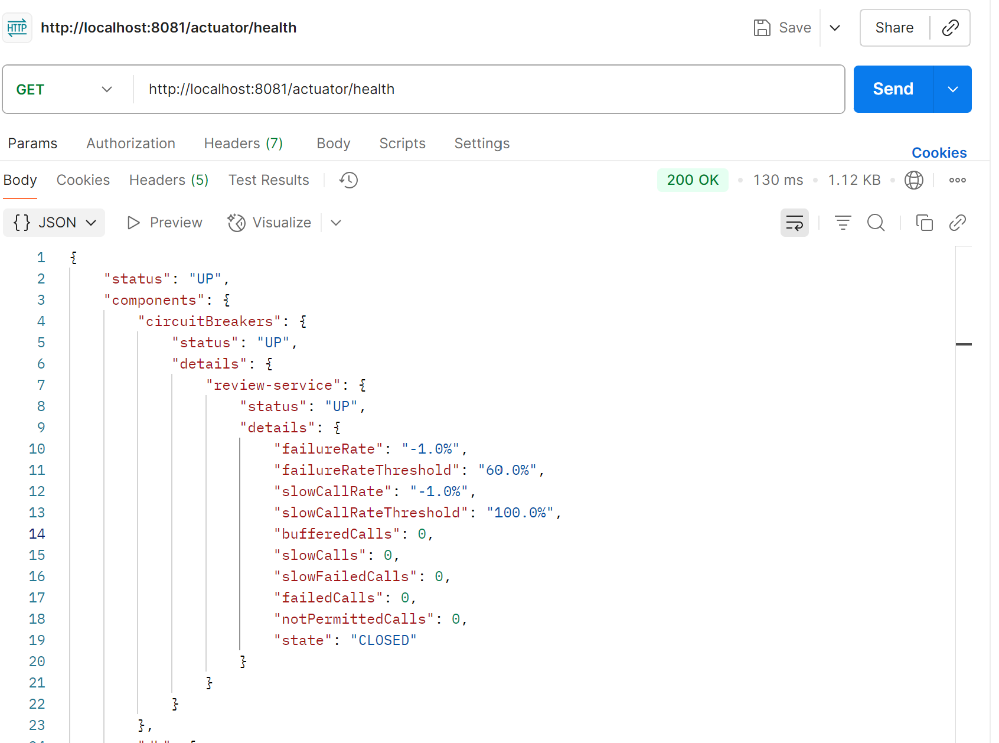
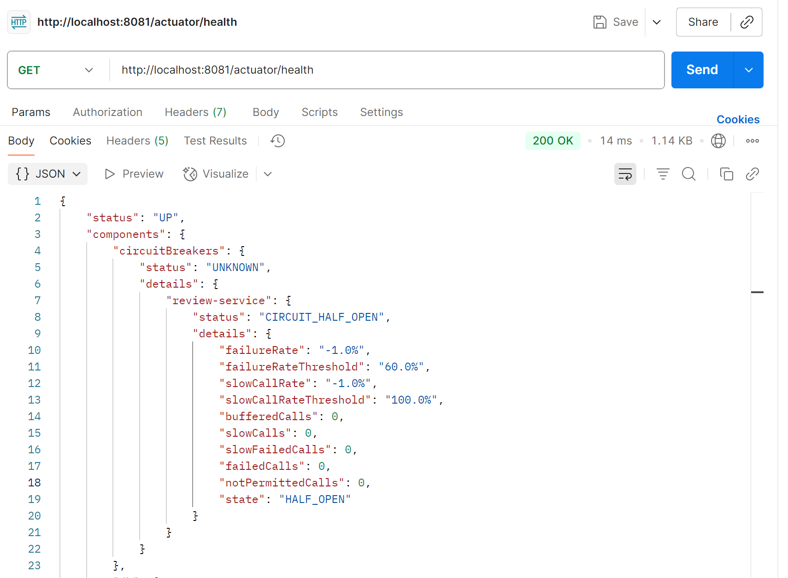
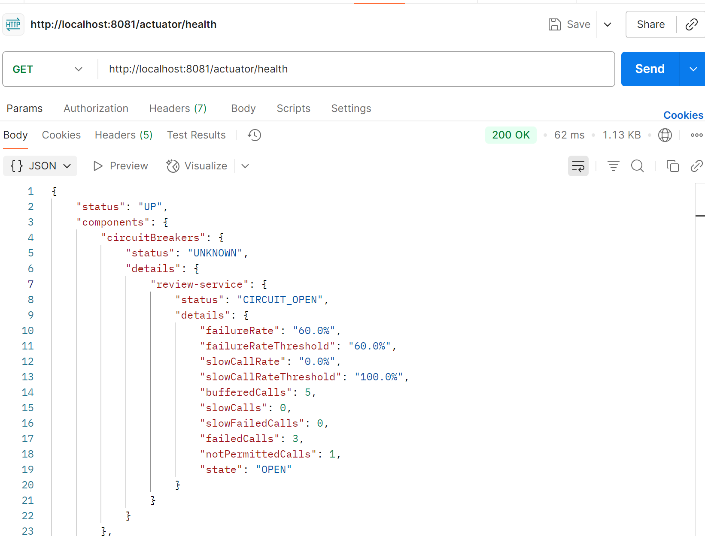
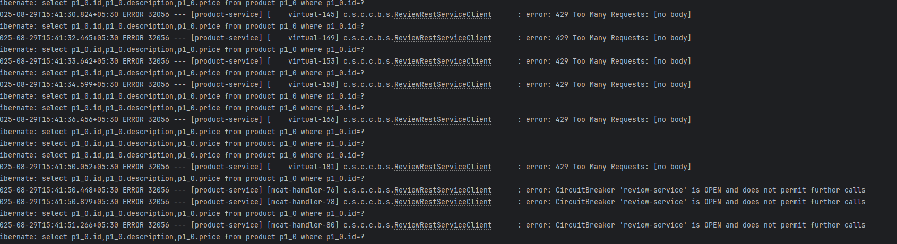
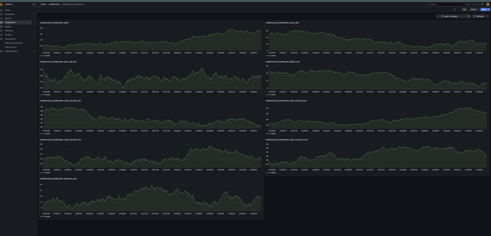

# Spring Cloud Circuit Breaker pattern
Circuit Breaker pattern in Spring Boot is a design pattern used to prevent cascading failures in a microservices 
architecture. It functions by detecting when a service is unresponsive or experiencing issues and then preventing 
further calls to that service, thereby protecting the overall system's stability.

- **Closed State**:
The circuit breaker allows requests to pass through to the target service. It monitors the success and failure rates of these calls.
- **Open State**:
If the failure rate exceeds a predefined threshold, the circuit "trips" and enters the open state. In this state, 
all subsequent calls to the target service are immediately rejected, and a fallback method is executed instead. 
This prevents further calls to the failing service and allows it time to recover.
- **Half-Open State:**
After a configurable waitDurationInOpenState, the circuit breaker transitions to a half-open state. In this state, 
a limited number of test calls are allowed to pass through to the target service.
  - If these test calls succeed, the circuit returns to the closed state, indicating the service has recovered.
  - If the test calls fail, the circuit returns to the open state, and the waiting period restarts.

# Configure Circuit Breaker
| Config Property                                    | Default Value                                                                                                                                                                                                                                                                                                                                                                                                                   | Description                                                                                                                                                                                                                                                                                                                                                                                                                 |
|----------------------------------------------------|---------------------------------------------------------------------------------------------------------------------------------------------------------------------------------------------------------------------------------------------------------------------------------------------------------------------------------------------------------------------------------------------------------------------------------|-----------------------------------------------------------------------------------------------------------------------------------------------------------------------------------------------------------------------------------------------------------------------------------------------------------------------------------------------------------------------------------------------------------------------------|
| failureRateThreshold                               | 50                                                                                                                                                                                                                                                                                                                                                                                                                              | Configures the failure rate threshold in percentage.      When the failure rate is equal or greater than the threshold the CircuitBreaker transitions to open and starts short-circuiting calls.                                                                                                                                                                                                                    |
| slowCallRateThreshold                              | 100                                                                                                                                                                                                                                                                                                                                                                                                                             | Configures a threshold in percentage.     The CircuitBreaker considers a call as slow when the call duration is greater than slowCallDurationThreshold  When the percentage of slow calls is equal or greater the threshold, the CircuitBreaker transitions to open and starts short-circuiting calls.                                                                                                      |
| slowCallDurationThreshold	                         | 60000 [ms]                                                                                                                                                                                                                                                                                                                                                                                                                      | 	Configures the duration threshold above which calls are considered as slow and increase the rate of slow calls.                                                                                                                                                                                                                                                                                                            |
| permittedNumberOfCalls   InHalfOpenState       | 	10	                                                                                                                                                                                                                                                                                                                                                                                                                            | Configures the number of permitted calls when the CircuitBreaker is half open.                                                                                                                                                                                                                                                                                                                                              |
| maxWaitDurationInHalfOpenState                     | 	0 [ms]	                                                                                                                                                                                                                                                                                                                                                                                                                        | Configures a maximum wait duration which controls the longest amount of time a CircuitBreaker could stay in Half Open state, before it switches to open.   Value 0 means Circuit Breaker would wait infinitely in HalfOpen State until all permitted calls have been completed.                                                                                                                                         |
| slidingWindowType	                                 | COUNT_BASED	                                                                                                                                                                                                                                                                                                                                                                                                                    | Configures the type of the sliding window which is used to record the outcome of calls when the CircuitBreaker is closed.  Sliding window can either be count-based or time-based.  If the sliding window is COUNT_BASED, the last slidingWindowSize calls are recorded and aggregated. If the sliding window is TIME_BASED, the calls of the last slidingWindowSize seconds recorded and aggregated.       |
| slidingWindowSize	                                 | 100	                                                                                                                                                                                                                                                                                                                                                                                                                            | Configures the size of the sliding window which is used to record the outcome of calls when the CircuitBreaker is closed.                                                                                                                                                                                                                                                                                                   |
| minimumNumberOfCalls	                              | 100	| Configures the minimum number of calls which are required (per sliding window period) before the CircuitBreaker can calculate the error rate or slow call rate.  For example, if minimumNumberOfCalls is 10, then at least 10 calls must be recorded, before the failure rate can be calculated. If only 9 calls have been recorded the CircuitBreaker will not transition to open even if all 9 calls have failed. |
| waitDurationInOpenState	                           |60000 [ms] |	The time that the CircuitBreaker should wait before transitioning from open to half-open.|
| automaticTransition  FromOpenToHalfOpenEnabled |	false	|If set to true it means that the CircuitBreaker will automatically transition from open to half-open state and no call is needed to trigger the transition. A thread is created to monitor all the instances of CircuitBreakers to transition them to HALF_OPEN once waitDurationInOpenState passes. Whereas, if set to false the transition to HALF_OPEN only happens if a call is made, even after waitDurationInOpenState is passed. The advantage here is no thread monitors the state of all CircuitBreakers.|
| recordExceptions	                                  | empty	| A list of exceptions that are recorded as a failure and thus increase the failure rate.  Any exception matching or inheriting from one of the list counts as a failure, unless explicitly ignored via ignoreExceptions.  If you specify a list of exceptions, all other exceptions count as a success, unless they are explicitly ignored by ignoreExceptions.|
| ignoreExceptions	                                  | empty	| A list of exceptions that are ignored and neither count as a failure nor success.  Any exception matching or inheriting from one of the list will not count as a failure nor success, even if the exceptions is part of recordExceptions.|
| recordFailurePredicate                             |	throwable -> true | By default all exceptions are recorded as failures.	A custom Predicate which evaluates if an exception should be recorded as a failure.   The Predicate must return true if the exception should count as a failure. The Predicate must return false, if the exception  should count as a success, unless the exception is explicitly ignored by ignoreExceptions. |
| ignoreExceptionPredicate                           |	throwable -> false | By default no exception is ignored. A custom Predicate which evaluates if an exception should be ignored and neither count as a failure nor success. The Predicate must return true if the exception should be ignored. The Predicate must return false, if the exception should count as a failure. |

**Closed State**

  

**Half-Open State**

  

**Open State**

 

**Application log state**

  

# Integrate Prometheus and Grafana Dashboard
can also have these metrics collected by Prometheus and visualized in Grafana. 
To demonstrate this, the repo contains a Docker Compose file that will start Prometheus and Grafana locally and 
scrape the metrics being surfaces at /actuator/prometheus.

- Run docker-compose up
  - Go to http://localhost:3000 and login with the username admin and the password admin
  There will be a datasource pointing to the docker container running Prometheus and dashboard already 
  configured to visualize the Resilience4J metrics
- Prometheus metrics
  - curl -X GET http://localhost:8081/actuator/prometheus